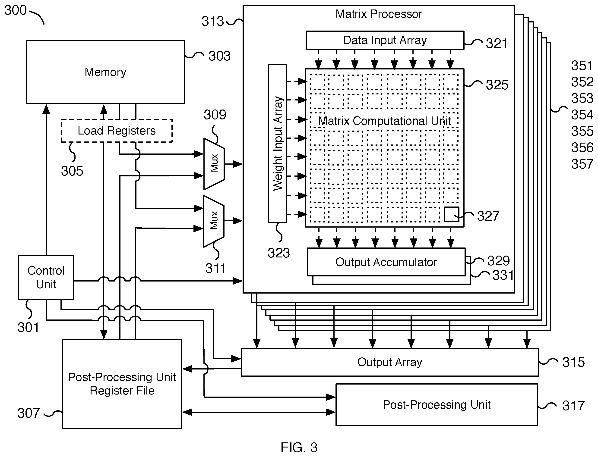

# outline
- dojo
- dojo core
- preprocess
- execute
- SRAM

# dojo
- tesla's in-house supercomputer for machine learning
- highly scalable and fully flexible distributed system
  - optimized for neural network training workloads
  - general-purpose systyem capable of adapting to new algorithms and applications
- built from grounds up with large systems in mind
  - not evolved from existing small systmes

# dojo system
- HW
  - D1
  - TILE V2
  - HBM DIP V2
  - DNIC V2
- SW
  - drivers
  - compiler engine: LLVM
  - extension: pytorch

# dojo core
- high throughput, general purpose CPU
  - full-fiedged commputers
    - dedicated CPU, local memory, commuunication interface
  - superscalar, multi-threads orgaanization
    - optimizied for high-throughput math applications rather than control heavy code
  - cutom ISA optimized for ML kernels
  - 1.25MB SRAM
    - 400GB/s scalar read
    - 270GB/s write sram

# D1
- TSMC 7nm, 645mm^2, 50billion transistors
- TDP 400W
- physically and logically arranged as a 2D array
  - 354 DOJO processing nodes on die
- extremely modular design
- 362 TFLops BF16/CFP8, 22TFlops FP32@2GHz
- 440MB SRAM
- custom low power serders channels on all edges
  - 576 bidirectional channels
  - 2TB bandwidth on each edge
- seamless connection to neighboring dies

# TILE
- unit of scale for system
- training tile
  - compute
  - I/O
  - power cooling
- TSMC SoW
- 5x5xD1
- 15kW

## dojo system tray
- high speed connectivity
- power + mechanical + thermal
  - 2000A at S2VDC
- dense integration
  - 75mm height to support 135kg
- 54 PFLops BF16/CFP8
- 13.4TB/s bisection BW
- 100+kW power

## HBM DIP
- high bandwidth memory for training
  - 800GB/s total memory bandwidth
- full bandwidth memory + ingest to tile
  - tesla transport protocol(TTP)
  - full custom protocol
- TTP over ethernet(TTPOE)
  - enables extending communication over standard ethernet native hardware support
- standard PCIE host interface
  - 32GB high bandwidth DRAM
  - 50GB/s ethernet bandwidth
  - 900TB/s TTP bandwidth
  - 32GB/s GEN4 PCIE bandwidth

## TTPOE
- disaggregated high speed memory
  - standard PCIe form factor, 20x cards per tray & 32GB HBM per card
- high bandwidth ingest
  - PCIe & ethernet connectivity
- high radix z-plane connectivity
  - shortcuts across compute plane
- 640GB high-bandwidth dram
- 1TB/S ethernet bandwidth
- 18TB/S aggregate bandwidth to tiles
- 1 trainning tile
  - 5 HBM DIP
  - 4.5TB/s = 5*900GB/s
  - 160GB HBM = 5*32GB

# host interface
- ingest proceessing
  - PCIe connectivity to interaface processors hardware video docoder support
- user applications
  - x86 linux environment
  - user scheduled jobs
- 512 total X86 cores
- 8TB totla memory
- 640GB/s PCIe bandwidth

# ExaPOD
- 120 training model
- 3000 D1
- 100 million training node
- 1.1EFlops BF16/CFP8
- 1.3TB SRAM
- 13TB DRAM

# D1, Tile, ExaPOD
- dojo core
- D1 = 354 dojo core
- tile = 25 D1
- ExaPOD = 120 tile = 3000 D1
## dojo core
- 1.25MB SRAM
- 1.024 TFlops
- 64bit
- 4*(8*8*4)
- 2GHz
## D1
- 440MB SRAM
- 362 TFlops
- 354 dojo core, Fault tolerance
- 654mm^2
## tile
- 1xtile <=> 1xA100
- 11GB SRAM
- 9050 TFlops
- 5x5 D1
# ExaPOD
- 1320GB SRAM
- 1.1 EFlops
- 1 ExaPOD = 10 cabinet = 10 * 12 tile = 10 * 12 * 25 D1 = 3000 D1
  - 1 cabinet <=> 12 tile 

# Architecture Design Philosophy
- Deposit and calculation integration
- The area of a single kernel is as small as possible
- 2GHz, only basic branch prediction and small instruction cache are used, and the rest of the area is given to the arithmetic logic unit
- Does not support data-side caching, does not support virtual memory, does not support precise exceptions

# compare
## D1
- 440MB SRAM
- 362 TFlops
- single processor, 354 cores, 654mm^2
- **throughput**
## A100
- 40MB SRAM
- 312 TFlops
- single processor, 128 cores = 128*4 TC = 512 TC

# dojo core
## parameters
- data type
  - FP16,FP32
  - BP16,CFP16
  - CFP8
- bit width
  - 64b
- SMT
  - 4 lane
- Multy matmul
  - 4x(8x8)
- main frequency
  - 2GHz
- fetch instruction
  - 32B
- SIMD
  - 64B
- SRAM size
  - 1.25MB
- SRAM rate
  - read: 400GB/s
  - write 270GB/s
## structure
- Front End
- Execution Engine
- Memory Subsystem
  - no local memory
  - no shared memory
- NoC - network on chip
- pros
  - simple
  - reduce control
    - eliminate rename
    - unsupport virtual address
## Front End
- BTB
  - branch target predictor
- PC x4
  - programmer counter
- I-Cache
  - instruction cache
  - connect to SRAM directly
- fetch bufferx x4
  - pre-thread fetch buffers
- decode x2
  - list parser engine provide packaged data buffer

## Execution Engine
- 4-wide Scalar scheduler, 4-way SMT
  - 2 integer ALUs
  - 2 address generate units, AGU 
  - register file replicated per thread
- 2-wide Vector scheduler, 4-way SMT
  - Vector RegFile
  - 64B wide SIMD dispatch unit
  - 8x8x4 matmul units
- SMT support focuses on single threaded application
  - NO virtual memory, limited protection mechanisms, SW-managed sharing of resources
  - Typical application uses 1 or 2 compute threads and 1-2 communication threads
- Matrix Computational Unit
  - data input array
  - weight input array
  - output accumulator
  - 

## SRAM
- 1.25MB
- reduce memory bound
- DMA
  - read from DDR/HBM to SRAM
- list parser engine
  - package instruction
  - allows efficient packaging of complex transfer sequences
  - most instructions execute in the front-end
  - sequence can run asynchronously on its own thread
    - different instrunction execute in different DOJO core
- data gather engine
  - package data 
  - send & store friendly register
- eliminate
  - L1
  - L2
  - virtual memory, TLB, page walk mechanisms
- address
  - 21bit
  - simplify AGU

# NoC Router
- 2D mesh spanning all processing nodes
  - Eight packets per cycle across the node boundary
- Each node has independent network connection
  - Direct SRAM connection, one read and one write packet per cycle
  - single cycle per hop in every direction
- Block level DMA operations for data push and pull
- Seanless connection to neighboring nodes
- SRAM/NoC
  - instrinsic: load/store HBM <-> register
- DOJO
  - DOJO D1
  - die
    - DDR
    - PCIe
    - die to die 100ns
  - IO
    - 9TB/s

# patent
- https://patents.google.com/patent/US20190235866A1/en?oq=US20190235866A1
- https://patents.google.com/patent/US20200348909A1/en?oq=US20200348909A1
- https://patents.google.com/patent/US20200349216A1/en?oq=US20200349216A1