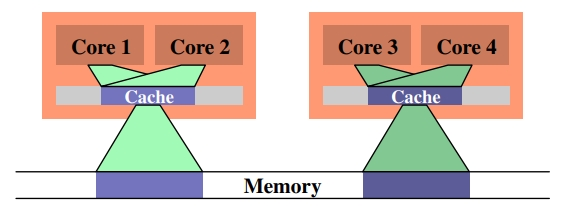

# Author
- Ulrich Drepper

# Institution
- Red Hat, Inc

# Submitted
- November 21, 2007

# Abstract
- As CPU cores become both faster and more numerous, the limiting factor for most programs is now, and will be for some time, memory access. Hardware designers have come up with ever more sophisticated memory handling and acceleration techniques–such as CPU caches–but these cannot work optimally without some help from the programmer. Unfortunately, neither the structure nor the cost of using the memory subsystem of a computer or the caches on CPUs is well understood by most programmers. This paper explains the structure of memory subsystems in use on modern commodity hardware, illustrating why CPU caches were developed, how they work, and what programs should do to achieve optimal performance by utilizing them.

# Problem
- neither the structure nor the cost of using the memory subsystem of a computer or the caches on CPUs is well understood by most programmers.
- imbalance between CPU and access memory

# Related work

# Key contribution
- the structure of memory subsystems
- illustrating why CPU caches were developed
- how they work
- what programs should do to achieve optimal performance by utilizing them

# Strengths

# Weaknesses
- It is limited to commodity hardware and further limited to a subset of that hardware

# abbreviation
- WSS: Working Set Size
  - https://www.brendangregg.com/wss.html
  - The Working Set Size (WSS) is how much memory an application needs to keep working. Your application may have 100 Gbytes of main memory allocated and page mapped, but it is only touching 50 Mbytes each second to do its job. That's the working set size: the "hot" memory that is frequently used. It is useful to know for capacity planning and scalability analysis.
- RSS: resident set size = main memory, Real memory pages that are currently mapped
- PSS: Proportional set size, RSS with shared memory divided among users
- L1/L2/L3: CPU cache
- FSB: Front Side Bus
- MTRRs: Memory Type Range Registers
- MESI: MESI cache coherency protocol (Modified, Exclusive, Shared, Invalid)
- RFO: Request For Ownership
- SMT: Symmetric Multi-Threading
- MMU: Memory Management Unit
- LRU: Least Recently Used
- SMC: Self Modifying Code
- VM: virtual memory
- DSOs: Dynamic Shared Objects, aka shared libraries
- TLB L1/L2: translation lookaside buffer
- ITLB: instruction TLB
- DTLB: data TLB
- ASID: Address Space ID
- EPTs: Extended Page Tables
- NPTs: Nested Page Tables
- VPIDs: virtual processor IDs
- HPC: high-performance computing
- MPI: Message Passing Interfaces
- NUMA: Non Uniform Memory Access
- NTA: non-temporal access; non-temporal aligned
- SIMD: Single Instruction, Multiple Data
- ABIs: application binary interfaces
- VLAs: variable length arrays
- BP: branch prediction
- LSD: Loop Stream Detector
- ASLR: Address Space Layout Randomization
- OOO: out-of-order
- MSR: Model Specific Register
- NICs: Network Interface Cards
- TLS: thread-local storage
- LL/SC: Load Lock/Store Conditional
- CAS: Compare-and-Swap
- CPI: Cycles Per Instruction
- LRU: Least Recently Used
- PGO: profile guided optimization
- LIFO: last in first out
- SPUs: Synergistic Processing Units

# Detail
## 1 Introduction
- bottleneck = main memory =  resident set size(RSS)
- solutions
  - RAM hardware design (speed and parallelism)
  - Memory controller designs
  - CPU caches
  - Direct memory access (DMA) for devices

## 2 Commodity Hardware Today
- Figure 2.1: Structure with Northbridge and Southbridge
```
             CPU1    CPU2
             /|\     /|\
              |       |
              ---------  FSB(the Front Side Bus)
                  |
                 \|/
  RAM <-->    Northbridge
                 /|\
                  |
                 \|/
  PCIE <-->   Southbridge <-> SATA/USB
```
  - FSB: the Front Side Bus
  - Northbridge: connect memory controller who decide RAM types such as DRAM, Rambus, SDRAM
    - communication between CPUs
    - communication between RAM
    - communication between CPU and device attached to the Southbridge
  - Southbridge: I/O bridge: PCI, PCI Express, SATA, and USB; PATA, IEEE 1394, serial, and parallel ports
  - direct memory access (DMA)
    - store and receive data in RAM directly without the intervention of the CPU
      - reduce the workload on CPU
      - creates contention for bandwidth of the Northbridge from CPUs
  - bus from Northbridge to RAM
    - 1 to all RAM
    - 2: DDR2
    - more: FB-DRAM

- Figure 2.2: Northbridge with External Controllers
```
                 CPU1    CPU2
                 /|\     /|\
                  |       |
                  ---------  FSB(the Front Side Bus)
                      |
                     \|/
  RAM <-> MC1 <-> Northbridge <-> MC3 <-> RAM
  RAM <-> MC2 <->             <-> MC4 <-> RAM
                     /|\
                      |
                     \|/
      PCIE <-->   Southbridge <-> SATA/USB
```
  - increase memory bandwidth
  - not controllable by software

- Figure 2.3:  Integrated Memory Controller
```
         RAM <-> CPU1 <-> CPU2 <-> RAM
                 /|\      /|\
                 \|/      \|/
         RAM <-> CPU3 <-> CPU4 <-> RAM
                 /|\      /|\
                 \|/      \|/
                  ---------- 
                     /|\
                      |
                     \|/
      PCIE <-->   Southbridge <-> SATA/USB
```
  - increase memory bandwidth
  - not controllable by software


### 2.1 RAM Types
- 2.1.1 Static RAM(SRAM)
  - 
  - pros
    - fast
  - cons
    - expensive
    - need individual power for the transistors maintaining the state
  - 6-T SRAM
    - one cell requires 6 transistors
    - maintaining the state of the cell requires constant power
    - state is available
    - state is stable
- 2.1.2 Dynamic RAM(DRAM)
  - 
  - 1T1C = one transistor and one capacitor
  - pros
    - size
    - simple
  - cons
    - slow
    - depending on the charge in the capacitor
      - reading the cell discharges the capacitor so must be recharged
      - refresh every 64ms
    - need sense amplifier
    - read + recharge
    - signals are not rectangular
      - RC: resistance x capacitance
    - 
- 2.1.3 DRAM Access
  - virtual address -> physical address -> cell on RAM -> address line
  - 4GB <-> $2^{32}$ address line
  - demultiplexer: N address lines, $2^N$ output lines
    - complexity: size & time & synchronous
  - solution: array approach
    - 
    - structure
      - row address selection(RAS)
      - column address selection(CAS)
      - multiplexer
      - cons
        - complication: delay after signal
        - amplify: wait RAS and CAS is done
- 2.1.4 Conclusions
  - there are reasons why not all memory is SRAM
    - directly addressed
    - limited in size
    - effort -> certain maximum speed
  - memory cells need to be individually selected to be used
  - the number of address lines is directly responsible for the cost of the memory controller, motherboards, DRAM module, and DRAM chip
  - it takes a while before the results of the read or write operation are available
### 2.2 DRAM Access Technical Details
- Synchronous DRAM(SDRAM)
  - clock: determines the speed of front side bus(FSB)
  - 200MHz -> quad-pumped -> 800MHz
  - 64bits = 8Bytes per data transfer
  - transfer rate = 8B*800MHz = 6.4GB/s
- 2.2.1 Read Access Protocol
  - 
  - CLK rising edge: all signal are read
  - RAS lowering: row address available
    - $t_{RCD}$ = RAS-to-CAS delay
  - CAS lowering: colume address available
    - CAS latency(CL)
  - transfer data
    - the more the better, filling entire lines
    - keeing the row open: new CAS without RAS
    - SDRAM: 1 word per cycle
    - DDR: 2 word per cycle
    - DDR2: faster, cheaper, more reliable, and is more energy efficient

- 2.2.2 Precharge and Activation
  - 
  - Precharge Row: before a new RAS signal can be sent
  - activation
  ```
  CAS -> CL -> DQ -> 
            -> WE | RSA --> tRP
  ```
  - w-x-y-z-T: 2-3-2-8-T1
    - w: 2: CL: CAS latency
    - x: 3: $t_{RCD}$ : RAS-to-CAS delay
    - y: 2: $t_{RP}$: row precharge time
    - z: 8: $t_{RAS}$: time SDRAM needs after RAS
    - T: T1: command rate
- 2.2.3 Recharging
  - surprisingly, DRAM refresh organization can affect performance dramatically
    - At times when a $row^{10}$ is recharged no access is possible
  - Joint Electron Device Engineering Council(JEDEC)
    - Each DRAM cell must be refreshed every 64ms
    - issue a refresh command on average every 7.8125µs
  - memory controller schedule the refresh commands
  - DRAM modul refreshed row + increases the address counter
- 2.2.4 Memory Types
  - 
  - single data rate(SDR) SDRAMs
    - memory cells = data transfer rate
    - same frequency f
    - rise f -> increase throughput -> increase voltage
    - $Power = DynamicCapacity * Voltage^2 * Frequncy$
  - double data rate(DDR1) SDRAMs
    - twice amount of data is transported per cycle, on the rising and falling edge
    - data bus consists of 2 lines
    - transfer_rate = frequency * busses * 2
  - DDR2
    - doubling of the frequency of the bus
    - doubling the bandwidth
    - 1.8V, 240 pins, 2 modules per bus, 16GB
  - DDR3
    - 1.5V, 240 pins, 1 modules per bus
    - reduce die size
    - higher bus frequencies -> higher data rate
    - slightly higher CAS latencies
  - problem
    - increased bus frequency makes it hard to create parallel data busses
  - solution
    - external memory controllers into each processor
      - expensive
      - AMD Opteron 
      - Intel CSI 
      - NUMA
    - serial bus
      - Intel FB-DRAM, 69 pins, 8 modules per bus, 192GB
      - more modules per channel can be used.
      - more channels per Northbridge/memory controller can be used.
      - the serial bus is designed to be fully-duplex (two lines).
      - it is cheap enough to implement a differential bus (two lines in each direction) and so increase the speed.
- 2.2.5 Conclusions
  - processor 2.933GHz, FSB 1.066GHz
    - 11:1
    - 1.066/4 = 0.2665
    - 2.933 / 0.2665 = 11
  - DRAM access is not sequential
    - precharging and new RAS signals
    - overlap through hardware and software prefetching

### 2.3 Other Main Memory Users
- HPC
  - network, mass-storage controller
  - direct memory access(DMA)
- USB
  - South- and Northbridge
- attach a Southbridge to each node, equally distributing the load on the FSB of all the nodes
## 3 CPU Caches
- increase the frequency of the memory bus is possible but it is not economical
- the speed of secondary storage, usually hard disks, is orders of magnitude slower than even DRAM access
- solution
  - SRAM: dedicate a certain area of the address space of the processor, extension of the register
  - DRAM: the rest
  - the gains of having fast memory would be eaten up completely by the overhead of administering the resources
- solution
  - SRAM is used to make temporary copies of (to cache, in other words) data in main memory which is likely to be used soon by the processor
    - code -> loop
    - data
      - access main memory takes 200 cycles
        - 200*100*100 = 2,000,000
      - access cache memory takes 15 cycles
        - 200*100 + 15*100*99 = 20,000 + 148,500 = 168,500
- cache size : main memory size = 1:1000
- 
### 3.1 CPU Caches in the Big Picture
- Minimum Cache Configuration
```
          main memory
              /|\
               |
              \|/              Bus
<--------------------------------->
   /|\
    |
   \|/
  cache <----> cpu core
```
  - connection between the CPU core and the cache is a special, fast connection
- von Neumann architecture
  - separate the caches used for code and for data
- bigger and slower than the first-level cache
- three levels of cache
```
          main memory
              /|\
               |
              \|/              Bus
<--------------------------------->
   /|\
    |
   \|/
  L3 cache
   /|\
    |
   \|/
  L2 cache <---->  L1i cache
   /|\                /|\
    |                  |
   \|/                \|/
  L1d cache <----> cpu core
```
- L1d is the level 1 data cache
- L1i the level 1 instruction cache
- Multi processor, multi-core, multi-thread

  - processor: big box shaded in lighter gray, do not share any cache with other processor
  - cores: shaded in darker gray, have separate copies of all the hardware resources, have individual L1 caches
  - Threads: shaded in orange, share almost all of the processor’s resources
  - L1 caches: light green

### 3.2 Cache Operation at High Level
- CPU need data
  - search in cache first
    - tagged: address + data(virtual, physical)
- efficient
  - big granularity, tag > 32bits
  - spatial locality
  - neighboring memory
  - “lines” of several contiguous words
- cache line = 64bytes
  - memory bus = 64bit
  - 64bytes/64bit = 8 transfers per cache line
- 32-bit address
  - TSO
  ```
  31                       0
  Tag     CacheSet    Offset
  ```
  - Offset = 6bits
    - cache line = 64bytes = 2^6
  - CacheSet
    - set instead of single slot
    - same in same set
  - Tag
    - distinguish in same set
- instruction modify
  - load cache line
  - dirty: written to and not written back
- eviction
  - load new data
    - L1 -> L2 -> L3 -> main memory
  - exclusive cache in L2
- symmetric multi-processor (SMP) 
  - cache coherency
    - All processors are supposed to see the same memory content at all times
-  cache coherency protocols
  - MESI
  - A dirty cache line is not present in any other processor’s cache.
  - Clean copies of the same cache line can reside in arbitrarily many caches.
  - monitor & compare
- cache hits and misses
  - actual access times
    |To Where | Cycles|
    |---|---|
    Register | ≤ 1
    L1d      | ∼ 3
    L2       | ∼ 14
    Main Memory | ∼ 240
  - L2
    - majority time is caused by wire delays
    - worse with increasing cache sizes
    - better with process shrinking
  - hidden the cost in parallel
    - read: no resource
    - write: CPU not wait until write done
- Access Times for Random Writes
  
  - Y–axis: the average number of CPU cycles it takes to process one element
  - X–axis: The size of the working set(WSS)
  - L1d is 2^13
  - L2 is 2^20
  - <10: entire fits into L1d
  - 10~28: have to load data from L2
  - 28~480: have to load data from main memory

### 3.3 CPU Cache Implementation Details
- cache : main memory = 1:1000
- 3.3.1 Associativity
  - Fully Associative Cache
  
    - <font color=red>set = CacheSet = 0, T only</font>
    - each cache line can hold a copy of any memory location
    - compare the tags of each
    - 4MB with 64B cache lines have 65536(2^16) entries
      - match in a few cycles
    - comparator 
      - two T-bit-wide values
      - cache line availabel
      - merge buckets data
      - iterative comparators takes too long
    - ASCS practial for samll caches: TLB
  - direct-mapped cache
    
    - <font color=red> set[1,16] </font>
    - L1 level
    - restrict the search
    - each tag maps to exactly one cache entry
    - |0-5|6-21|22-31|, set[1,16]~6:21
    - 1 x comparator
    - 2 x multiplexer
    - tag and data are seperated    
    - pros
      - fast and relatively easy to implement
    - cons
      - addresses must be evenly distributed
      - heavily used and therefore repeated evicted
  - Set-Associative Cache
    
    - <font color=red> set[8,13] </font>
    - tag and data storage are divided into sets
    - compare tag parallel
    - cache is not limited by the number of comparators, increase column instead of row
    - L2: 24 set; L1: 8 set
    - 65536/8 = 8192 set[8,13] = 2^13
  - L2 cache miss
    - Effects of Cache Size, Associativity, and Line Size
    - cache size = cache line size × associativity × number of sets
  - addresses map
    - $O = log_{2}^{cache-line-size}$
    - $S = log_{2}^{number-of-sets}$
  - associativity can indeed help to reduce the number of cache misses significantly
  - peak memory
  - more cores -> more associativity of the shared caches
  - large cache -> better performance
  - stay same set
  - memory layout
    - 
    - both single-linked list
    - random order, sequential order
- 3.3.2 Measurements of Cache Effects
  - working set sizes(WSS)
    ```
    struct l {
      struct l *n; // next cache line entry
      long int pad[NPAD]; // payload
    };
    ```
    - elements = 2^N/sizeof(struct l)
    - ws[elements]
    - NPAD = 7
      - 32-bit systems: size of each array element is 32 bytes
      - 64-bit systems: size of each array element is 64 bytes
    - env: 16kB L1d and 1MB L2
    - self env:
    ```
      cat /proc/cpuinfo
      cache size	: 6144 KB

      getconf -a | grep CACHE
      LEVEL1_ICACHE_SIZE                 32768 = 32KB = 2^15
      LEVEL1_ICACHE_ASSOC                8
      LEVEL1_ICACHE_LINESIZE             64
      LEVEL1_DCACHE_SIZE                 32768 = 32KB = 2^15
      LEVEL1_DCACHE_ASSOC                8
      LEVEL1_DCACHE_LINESIZE             64
      LEVEL2_CACHE_SIZE                  262144 = 256KB = 2^18
      LEVEL2_CACHE_ASSOC                 4
      LEVEL2_CACHE_LINESIZE              64
      LEVEL3_CACHE_SIZE                  6291456 = 6MB = 2^22 * 1.5
      LEVEL3_CACHE_ASSOC                 12
      LEVEL3_CACHE_LINESIZE              64
      LEVEL4_CACHE_SIZE                  0
      LEVEL4_CACHE_ASSOC                 0
      LEVEL4_CACHE_LINESIZE              0
    ```
  - Single Threaded Sequential Access 
    - 
    - 0    ~ 2^14
    - 2^15 ~ 2^20
    - 2^21 ~ infinite
    - no sharp edges
      - caches are used by other parts of the system: L2 instructions
    - L1d hits
      - 4 cycles
      - L1d noise: workload is simply too small to filter the effects of the rest of the system out
    - L2d hits
      - theory: 14 cycles
      - prefetch: 9 cycles
    - main memory
      - theory: 200+ cycles
      - prefetch: 9 cycles
    - 
    - L1d
      - ignore L1d noise: 4 cycles
      - L1d no prefetching necessary
    - L2d hits
      - 28 cycles
      - prefetching from L2 into L1d is basically disabled
    - exceeds the L2 capacity
      - element sizes domain performance
      - avoid unnecessary prefetch which is smaller than the prefetch window
    - hardware prefetch limitation
      - cannot cross page boundaries, OS involved
      - TLB cache missing
        - store translation of a virtual address to physical address 
        - translation very costly
    - 
    - observe test
      - case1: lay out the elements sequentially
        - 1 list <-> 1 cache line
        - 64 elements <-> a new page
      - case2: place each list element on a separate page  
      - when the working set size(WSS) reaches 2^13 bytes the TLB cache overflows
        - TLB cache has 64 entries
      - compute the physical address and store it in the TLB is very high
      - large NPAD -> TLB miss
    - 
    - element width is in all cases 16 bytes
    - baseline
      - eviction
    - Inc: pad[0] += 2
      - loaded from main memory
    - Addnext0: pad[0] += pad[next]
      - pad[next] already in the L1d cache
      - eviction -> bandwidth cut in half
    - 
    - Larger L2/L3 Caches -> more sequential efficient cache
    - first: 32k(2^15) L1d and an 1M(2^20) L2
    - second: 16k(2^14) L1d, 512k(2^19) L2, and 2M(2^21) L3
    - Core2 processor has 32k(2^15) L1d and 4M(2^22) L2
    - working set size(WSS) > last level cache and the main memory gets heavily involved
    - larger the last level cache -> longer keep L2 access costs
  - Single Threaded Random Access
    - 
    - prefetch: hide predictable access latency
    - process prefetch the data close to each other
    - big working set size(WSS) -> large cycles
      - main memory: 200-300 cycles
      - prefetch: 450 cycles
    - not flattening
      - 
      - WSS > L2, cache miss increase
        - Sequential ->  modest increase
        - random -> more than double because of TLB miss

- 3.3.3 Write Behavior
  - caches are coherent
  - cache line is modified -> main memory is modified
    - write-through cache implementation
      - immediately writes the cache line into main memory
      - discard cache content
      - pros
        - simplest
      - cons
        - not very fast
    - write-back cache implementation
      - the cache line is only marked as dirty
      - write the data back when dropped
      - pros
        - efficient
        - store in the free capacity on the FSB 
      - cons
        - sophisticated
        - more than one processor accessing the same memory
  - cache policies
    - write-combining
      - reduce transfer times
      - transfer entire cache line
      - combines multiple write accesses
    - uncacheable
      - turn an LED on and off
    - MTRRs
- 3.3.4 Multi-Processor Support
  - access between processors
    - direct
      - not fast
    - transfer the cache
      - when?
        - one processor need
      - how can determine whether dirty?
        - broadcasting is impractical
        - MESI cache coherency protocol
          - Modified: The local processor has modified the cache line. This also implies it is the only copy in any cache
          - Exclusive: The cache line is not modified but known to not be loaded into any other processor’s cache
          - Shared: The cache line is not modified and might exist in another processor’s cache
          - Invalid: The cache line is invalid, i.e., unused
  - 
    - initially = Invalid
    - writing = modified
    - read by another processor = Shared
    - otherwise Exclusive
    - modified cache line
      - access by local process
        - state dose not change
      - read by other process
        - local processor send the content to the second processor
        - change the state to Shared
        - memory controller store the content, too
      - write by other process
        - local processor send the content to the second processor
        - change the state to Invalid
        - Request For Ownership (RFO)
        - costly, write content to the next higher-level cache  
    - Shared cache line 
      - read by local process
        - state dose not change
      - write by local process
        - change the state to modified
        - copies in other processors are marked as Invalid through RFO message
      - read by other process
        - nothing
      - write by other process
        - RFO marked as Invalid
    - Exclusive cache line
      - same as Shared
      - write by local process
        - do not have to be announced on the bus
      - E->M much faster then S->M
    - RFO
      - A thread is migrated from one processor to another and all the cache lines have to be moved over to the new processor once
      - A cache line is truly needed in two different processors
    - synchronization implemented using memory
    - processors shared the FSB
    - minimize accesses from different processors and cores to the same memory locations
  - Multi Threaded Access
    - 
      - sequential read-only access for 128 bytes entries
        - a = b[i]
      ```
                bus                     bus  |- process0
        memory <---> memory controller <---> |- process1
                                             |- process2
                                             |- process3
      ```
      - 4 processors
      - 1 memory controller
      - 1 bus
      - acess same memory modules
      - no write, no sync, no RFO
      - decrease
        - 2 threads: 18%
        - 4 threads: 34%
      - bottlenecks = bus
        - processor <--> memory controller 
        - memory controller <--> memory
      - WSS > L3
        - bandwidth is not sufficient
    - 
      - a = b[i] + 1
      - decrease
        - 2 threads: 18%
        - 4 threads: 93%
      - bus saturating
        - prefetch
        - write-back
      - L1D
        - 1 thread: WSS > L1D, 20 cycle
        - 2 thread: WSS < L1D, 20 cycle
      - RFO
        - synchronization dominate the execution time
    - 
      - a = b[i] + b[i+1]
      - decrease
        - 2 threads: 90+%
        - 4 threads: 200+%
      - bus saturating
        - prefetch
        - write-back        
    - Table 3.3: Efficiency for Multiple Threads
      - 2 threads: expect speed-up 2, actual 1.69-1.54
      - 4 threads: expect speed-up 4, actual 2.98-1.65
    - 
      - WSS < L2 < L3
        - linear acceleration, *4
      - WSS > L3
        - crash, *1.6
      - 1 memory controller <--> 4 CPU
  - Special Case: Hyper-Threads
    - Symmetric Multi-Threading, SMT
    - threads share almost all the processing resources except for the register set
    - CPU is responsible for time multiplexing the threads
      - running hyper-thread is delayed, most caused by memory accesses
      - schedule another hyper-thread to use ALUs
    - execution time for a program
      - $T_{exe} = N[(1 − F_{mem})T_{proc} + F_{mem}(G_{hit}T_{cache} + (1 − G_{hit})T_{miss})]$
        - N = Number of instructions.
        - Fmem = Fraction of N that access memory
        - Ghit = Fraction of loads that hit the cache
        - Tproc = Number of cycles per instruction
        - Tcache = Number of cycles for cache hit
        - Tmiss = Number of cycles for cache miss
        - Texe = Execution time for program
    - 
      - decrease cache hit
      - collaborate use common cache
      - different code in hyper-threads -> significant increase in cache misses
- 3.3.5 Other Details
  - addresses
    - virtual
    - physical
  - same virtual address -> different physical addresses
    - over time
    - in different processes
  - MMU
    - virtual translate to physical
  - cache logic
    - quick in determining whether the memory location is cached
    - virtual can use cache lookup
    - hide access cost
  - L1  
    - page table tree changed -> partial clearing
    - avoid a complete flush: allows to specify the virtual address range
    -  3 cycles: using virtual mandatory
  - L2, L3
    - physical
    - slow & large
  - attention
    - same physical memory not location to two or more virtual addresses in the same process
  - cache replacement strategy
    - Least Recently Used (LRU) first
    - associativity
  - Virtual Machine Monitor (VMM, aka Hypervisor)
    - responsible for the physical memory assignment
  - programmer
    - a) use logical memory pages completely 
    - b) use page sizes as large as meaningful to diversify the physical addresses as much as possible

### 3.4 Instruction Cache
- instructions executed by the processor
  - quantity -> code size -> complexity of the problem
  - compiler generate good code
  - Program flow is predictable than data access patterns. detecting patterns -> prefetching.
  - Code always has quite good spatial and temporal locality
- pipeline
  - clock increase -> pipeline -> instruction execute in stages(>20)
  - decode -> prepare parameter -> execute
  - stall
    - cannot be correctly predicted
    - too long to load the next instruction
    - branch prediction
  - decode  
    - skip in L1d by trace cache
      - raw byte -> decoded instructions
    - L2
      - raw byte
      - smallest
      - help prefetch decisionpessimistic
- 3.4.1 Self Modifying Code
  - Self Modifying Code (SMC)
    - reduce code size
    - change the program itself over time
    - performance
    - security
  - avoid
    - if not done process have to update all state
    - Memory is not such a scarce resource
    - separate functions -> specific needs
    - bypass L1d
  - SI
    - code pages are immutable
    - Shared: The cache line is not modified and might exist in another processor’s cache
    - Invalid: The cache line is invalid, i.e., unusedpessimistic
    - MODIFY -> pessimistic assumptions
  - linux
    - code is write-protected
    - link time can create an executable where the code pages are writable
    - counters

### 3.5 Cache Miss Factors
- 3.5.1 Cache and Memory Bandwidth
  - test: SSE instructions load or store 16 bytes at once
    - https://docs.oracle.com/cd/E18752_01/html/817-5477/eojde.html
    - https://blog.csdn.net/qq_27825451/article/details/103934359
    - SIMD Single-Precision Floating-Point Instructions (SSE)
    - 
      - WSS: 1kB -> 512MB
      - B/C: bytes/cycle
      - read
        - WSS < L1d: 16 B/C, movaps
        - L1d < WSS < L2: 6 B/C
        - exhaustion DTLB: 5.3 B/C, prefetched into L2
      - Write-Through & copy
        - limited by the L2 speed
        - WSS < L2: 4 B/C
        - WSS > L2: 0.5 B/C
    - 
      - hyper-threads has only half the cache and bandwidth available
      - each thread has to wait a lot
    - 
      - read
        - WSS > L2: 15+ B/C, DTLB, prefetched into L1d
      - Write-Through & copy
        - WSS < L1d: 15+
        - L1d < WSS < L2: 6 B/C
        - WSS > L2: 1 B/C
    - 
      - no sync
      - read: same as 1 thread
      - Write-Through & copy
        - WSS < L1d: 1 B/C
        - L1d < WSS < L2: 4 B/C
          - 2 thread share L2
          - L1d misses are satisfied by the L2 cache
          - RFO messages are only needed when the data has not yet been flushed
        - WSS > L2: 1 B/C
    - 
      - 64kB L1d, 512kB L2, and 2MB of L3, L3 shared with all cores
      - read
        - WSS < L1d: 36
        - L1d < WSS < L3: 2.3 B/C
      - write
        - WSS < L1: 18.7 B/C
        - L1 < WSS < L2: 5 B/C
        - L2 < WSS < L3: 2.8 B/C
        - WSS > L3: 0.5 B/C
      - copy
        - dominated by the read performance and later by the write performance
    - 
      - read: same as 1 thread
      - write
        - quite inefficient even if the L3 cache size is sufficient to hold WSS
- 3.5.2 Critical Word Load
  - main -> blocks
    - 64 bits per transfer = 1 blocks?
    - 64 bytes = cache line size
    - 8 = 64 bytes/64 bits
  - DRAM
    - burst mode: 64 bytes per transfer
    - best: prefetch + burst
  - miss
    - Each block arrives 4 CPU cycles or more later than the previous one
    - the data which needed is the eighth of cache line, wait = 8 * 4 = 32 cycles
  - Critical Word First & Early Restart
    - memory controller free to request the words of the cache line in a different order
    - processor request the critical word, MC request it first
    - processor run, cache line run parallel
    - processor don't known the critical word during the prefetch
  - 
    - the position of the critical word on a cache line
      - first - last
      - WSS < L2, last slower 0.7% for sequential and random access
- 3.5.3 Cache Placement
  - out of control
    - where the caches are placed
  - under control
    - where the threads are executed
  - relation
    - cache <--> CPU
  - affinity
  - core
    - Early multi-core processors had no shared caches at all.
    - Later Intel models have shared L2 caches for dualcore processors. For quad-core processors we have to deal with separate L2 caches for each pair of two cores. There are no higher level caches.
    - AMD’s family 10h processors have separate L2 caches and a unified L3 cache
  - overlap
    - not overlap between cores -> do not need shared cache
    - overlap
      - not shared: both cache contain the most actively used data, wasted
      - sharing L1: available cache memory is increased
  - test
    - 
    - constantly reading or writing
    - SSE
    - 2MB block = 2^21
    - L2 = 4MB
    - second process reads and writes a memory region of variable size
    - WSS > 2^20(1MB), performance deteriorate 
      - background process is writing
      - cache eviction 
  - multi-core processors need more layers
    - cache size
    - associativity
    - large L3
    - reasonably-sized L2

- 3.5.4 FSB Influence
  - running a program on two machines
    - 667MHz
    - 800MHz
  - Addnext0: pad[0] += pad[next]
  - 
    - WSS > L2
      - 667MHz: 160 cycle
      - 800MHz: 140 cycle, 18.2% increase
    - faster FSB -> good performance
  - FSB 1,333MHz
## 4 Virtual Memory
- VM makes each process think it is alone in the system
- OS has to fill out the page table data structures
- MMU
  - input: a virtual address
  - 32-bit or 64-bit
- physical address = high part + low part
### 4.1 Simplest Address Translation
- MMU can remap addresses on a page-by-page basis
- virtual address is split into distinct parts
  - 
    - Directory
      - select an entry in a Page Directory
      - can be individually set by the OS
    - Offset
      - physical memory page
  -  complete physical address 
    - page directory
    - low bits from the virtual address
    - additional information
  - where to cache
    - in main memory
    - contiguous physical memory
    - base address store in a special register
  - example1
    - 4MB = 2^22
    - offset: 22bit
    - total = 32bit
    - directory = 32-22 = 10bit base address
    - #entries = 2^10 = 1,024

### 4.2 Multi-Level Page Tables
- example2, default used
  - 4KB = 2^12
  - offset: 12bit
  - total = 32bit
  - directory = 32-12 = 20bit base address
  - #entries = 2^20 = 1,048,576
  - 1 table size = 4Bytes
  - table size in 1 thread = 4B * #entries = 4B * 2^20 = 4MB
  - table size in 1 process = #thread * 4MB
  - large -> costly
- solution
  
    - multiple levels of page tables
    - huge, sparse page directory
    - not actually used -> not allocated
    - virtual address = 4 * directories + 1 * offset
  - page tree walking
    - highest level -> next -> ... -> level 1 directory
  - 1 process -> own page table tree
    - small -> better performance and scalability
    - place the used memory in the virtual address space
- example2
  - 4KB = 2^12
  - offset: 12bit
  - total = 32bit
  - #entries = 512 = 2^9
  - 4 level = 1 + 1 + 1 + 9 = 12
  - total = 12 + 12 = 24
- stack and heap allocated at pretty much opposite ends of the address space
  - need 2 level 2 directories
- For security 
  - code, data, heap, stack, DSOs mapped at randomized addresses
- For performance 
  - turned off randomization
  - load all DSOs contiguously in virtual memory

### 4.3 Optimizing Page Table Access
- data structures store in main memory
  - slow
    - creation of a process
    - change of a page table
    - a single access by the running process: 4 access
  - cache in L1d, L2
    - horrible 
    - cannot be parallelized
    - 4 page table levels: 12 cycles
    - L1d miss
  - address computation cached, too
    - high part save as tag
    - instructions or data objects share the same tag == same physical address prefix
  - TLB
    - Look-Aside Buffer
    - computed values are stored in TLB
    - multi-level TLB caches
    - the higher-level caches are larger and slower
    - LRU eviction policy
  - tag has a match
    - physical address = tag + offset
  - L2 look-ups
    - TLB lookup misses -> page table walk
  - implicitly prefetch
    - entries for the TLB on another page
    - hardware could initiate page table walks that are invalid
    - software prefetch instructions
    - instruction TLB (ITLB) and a data TLB (DTLB)
- 4.3.1 Caveats Of Using A TLB(translation lookaside buffer)
  - TLB is a processor-core global resource
  - different page table tree beteen process, kernel and VMM
  - change address space layout
    - flush
    - extend tags
  - flush
    - when
      - context switch
      - leaving / entering the kernel address space
      - call the VMM
    - effective but expensive
      - kernel code restricted thousand instructions
      - instructions touch new page
      - replace entries touched
      - full flush would be flushed unnecessarily
      - system call returns to the same process
  - optimize the cache flushes
    - individually invalidate TLB entries
      - only the pages falling into this address range have to evicted from the TLB
      - comparing tags
      - munmap
    - extended TLB tagging
      - add do not need flush
      - unique identifiers
        - kernel, VMM, and the individual processes
      - bits for the TLB tag is limited
      - reused identifier must be flushed
      - Special address spaces used by the kernel and VMM
      - switching between two threads of the same process no TLB flush is necessary at all
      - 1-bit Address Space ID(ASID)
        - distinguish VMM’s address space and guest domains
- 4.3.2 Influencing TLB Performance
  - pages size
    - pros
      - larger -> more instructions -> reduces translations -> fewer cache
      - multiple different page sizes can be used concurrently
    - cons
      - pages must be contiguous in physical memory
      - larger -> more wasted
    - large pages = N * small pages
      - 2MB = 4KB * 512
      - 512 contiguous physical memory are needed, it's impossible
    - using hugetlbfs at system start time
      - A fixed number of physical pages are reserved for exclusive use as big virtual pages
      - increasing -> restarting system
      - Database servers use huge pages
  - virtual page size
    - Memory mapping operations must conform to the minimum virtual page size
    - page size beyond the account when ELF was built, operation cannot be performed
    - alignment requirements encoded in the ELF program header 
    ```
      $ readelf -l a.out 

      Elf file type is DYN (Shared object file)
      Entry point 0x12c0
      There are 13 program headers, starting at offset 64

      Program Headers:
        Type           Offset             VirtAddr           PhysAddr           FileSiz            MemSiz              Flags  Align
        PHDR           0x0000000000000040 0x0000000000000040 0x0000000000000040 0x00000000000002d8 0x00000000000002d8  R      8
        INTERP         0x0000000000000318 0x0000000000000318 0x0000000000000318 0x000000000000001c 0x000000000000001c  R      1
            [Requesting program interpreter: /lib64/ld-linux-x86-64.so.2]
        LOAD           0x0000000000000000 0x0000000000000000 0x0000000000000000 0x0000000000000a68 0x0000000000000a68  R      1000
        LOAD           0x0000000000001000 0x0000000000001000 0x0000000000001000 0x0000000000000da5 0x0000000000000da5  R E    1000
        LOAD           0x0000000000002000 0x0000000000002000 0x0000000000002000 0x0000000000000458 0x0000000000000458  R      1000
        LOAD           0x0000000000002d20 0x0000000000003d20 0x0000000000003d20 0x00000000000002f0 0x0000000000000350  RW     1000
        DYNAMIC        0x0000000000002d30 0x0000000000003d30 0x0000000000003d30 0x00000000000001f0 0x00000000000001f0  RW     8
        NOTE           0x0000000000000338 0x0000000000000338 0x0000000000000338 0x0000000000000020 0x0000000000000020  R      8
        NOTE           0x0000000000000358 0x0000000000000358 0x0000000000000358 0x0000000000000044 0x0000000000000044  R      4
    ```
    - Load
      - Align 1000, 0x1000 = 4096 = 4KB = the maximum page size
  - larger page sizes -> reduce level -> increase virtual address to page offset -> reduce work in case of a TLB miss
  - reduce the number of TLB entries
    - moving data to fewer pages

## 4.4 Impact Of Virtualization
- Xen Virtualization Model
  ```
  I/O   I/O     I/O   I/O     I/O   I/O 
  Dom0_kernel   DomU_kernel   DomU_kernel
  ---------------------------------------
                Xen XMM 

  ```
  - VMM hands out physical memory to the Dom0 and DomU kernels
  - kernels implement the usual memory handling as if they were running directly on a processor
  - VMM creates its own page table tree for each kernel domain and hands out memory using these data structures
    - access to the administrative information of the page table tree can be controlled
  - shadow page tables
    - guest OS modifies its page tables -> VMM is invoked
    - avoid the creation of shadow page tables
      - speed
      - reduces memory
    - guest virtual address -> host virtual addresses -> actual physical addresses -> only one page table tree
- the complete result of the lookup
  - ASID
  - VPIDs
- KVM Virtualization Model
  ```

  user_level    guest_level   guest_level
  process

                KVM_VMM       KVM_VMM
  ----------------------------------------
                Linux Kernel
  ```
  - Linux kernel manage the memory of the system
  - KVM_VMM controll para- or full virtualization
- with virtualization used, cost of cache misses (instruction, data, or TLB) is even higher than without virtualization

## 5 NUMA Support
- access originated -> cost
### 5.1 NUMA Hardware
- Q: many processors access the same memory
- Multiport RAM is complicated and expensive
- Hypercubes
  ```
                              6_____8
                             /     /|
      2       2-----4       5-----7 |
      |       |     |       | |   | |
      |       |     |       |/2---|/4
      1       1-----3       1-----3

    C=1         C=2         C=3
  ```
  - C is the number of interconnect interfaces each node has
- SGI’s NUMAlink interconnect fabric
### 5.2 OS Support for NUMA
- processor access local memory instead of remote memory
- Q: DSOs
  - “mirror” such DSOs into each processor’s physical RAM and use local copies
- avoid migrating processes: cache content is lost
- the memory use will be very unequal
- stripe the memory
- A process can select a different strategy for itself and its children
### 5.3 Published Information
### 5.4 Remote Access Costs

## 6 What Programmers Can Do
### 6.1 Bypassing the Cache
- non-temporal write
  - the data will not be reused soon, so there is no reason to cache it
  - the new content is directly written to memory
- write-combining
  - fill entire cache lines
  - memory address must be aligned to 8 or 16 bytes respectively
  - issue all the instructions which modify a single cache line one after another
  ```
    #include <emmintrin.h>
    void setbytes(char *p, int c)
    {
      __m128i i = _mm_set_epi8(c, c, c, c,
                                c, c, c, c,
                                c, c, c, c,
                                c, c, c, c);
      _mm_stream_si128((__m128i *)&p[0], i);
      _mm_stream_si128((__m128i *)&p[16], i);
      _mm_stream_si128((__m128i *)&p[32], i);
      _mm_stream_si128((__m128i *)&p[48], i);
    }
  ```
  - memset(p, c)
  - write-combining logic
    - receive movntdq * 4
    - issue write command * 1
  - pros
    - avoids reading before written
    - avoid polluting the cache with data which might not be needed soon
- dcbz
  - clear an entire cache line
- writing a matrix
  - Figure 6.1: Matrix Access Pattern
    - row: laid out sequentially in memory
      ```
        for i in range(N):
          for j in range(N):
            M[i][j] = 0;
      ```
    - col: 
      ```
        for i in range(N):
          for j in range(N):
            M[j][i] = 0;
      ```
  - Table 6.1: Timing Matrix Initialization
    ```
                        Inner Loop Increment
                        Row     Column
          Normal        0.048s  0.127s
          Non-Temporal  0.048s  0.160s
    ```
    - N = 3000
    - Row: memory is used sequentially get better result
      - 0.048s -> 750MB/s
      - throughput = (3000*3000*32bit)/0.048s = (3000*3000*4Byte)/0.048s = 750*10^6 B/s = 750MB/s
      - sequential access is just as fast here as in the case where the cache is used
        - use write-combining
        - program needs to explicitly insert memory barriers: more freedom to write back the data
    - Column: more-orless random access
      - 0.127s -> 280MB/s
      - throughput = (3000*3000*32bit)/0.127s = (3000*3000*4Byte)/0.127s = 283*10^6 B/s = 283MB/s
      - uncached accesses are slower
        - 0.16s -> 225MB/s, 25% worse
        - no write combining is possible
        - each memory cell must be addressed individually
        - requires constantly selecting new rows in the RAM chips with all the associated delays cached run
- NTA: non-temporal access
  - prefetch instructions
  - small load buffers
  - 1 buffer = 1 cache line
  - first movntdqa load a cache line into a buffer
  - subsequent will not be loaded into a cache
  ```
    #include <smmintrin.h>
    __m128i _mm_stream_load_si128 (__m128i *p);
  ```
  - it can read from two memory locations at once
- optimize
  - sequential
  - cache

### 6.2 Cache Access
- L1 cache yield the best results
  - improve locality (spatial and temporal) 
  - align the code and data
- 6.2.1 Optimizing Level 1 Data Cache Access
  - processor automatically prefetches data when memory is accessed sequentially
  - N = 1000
  - straight-forward
  ```
    for i in range(N):
      for j in range(N):
        for k in range(N):
          T[i][j] += A[i][k] * B[k][j]
  ```
    - A is accessed sequentially
    - B non-sequential accesses per column
  - transposed
  ```
    for i in range(N):
      for j in range(N):
        BT[i][j] = B[j][i]
    for i in range(N):
      for j in range(N):
        for k in range(N):
          T[i][j] += A[i][k] * BT[j][k]
  ```
    - BT: additional temporary transposed matrix memory
  - 76.6% speed-up
  ```
              Original        Transposed
    Cycles    16,765,297,870  3,922,373,010
    Relative  100%            23.4%
  ```
    - non-sequential accesses really hurt
  - does not require the additional copy
    - B is too large
    - memory is too small
  - math and original implementation
    - add order is irrelevant
    - reorder the additions in the inner loop
    - B
      - (0,0) (1,0) ... (N-1,0)
      - (0,1) (1,1) ... (N-1,1)
      - ...
      - (0,0) (0,1) in the same cache line
      - when (0,1) needed, the cache line has long been evicted
    - 1000 cache lines per matrix
      - 64B * 1000 * 3 = 32K L1d
    - sysconf (_SC_LEVEL1_DCACHE_LINESIZE)
      - L1d cache line size of 64 bytes
      - gcc -DCLS=$(getconf LEVEL1_DCACHE_LINESIZE) ...
    ```
      SM = (CLS / sizeof (double))
      for i in range(0,N,SM):
        for j in range(0,N,SM):
          for k in range(0,N,SM):
            for i2 in range(0,SM,1):
              rT = T[i][j + i2*N]
              rA1 = A1[i][k + i2*N]
              for k2 in range(0,SM,1):
                rB2 = B2[k][j + k2*N]
                for j2 in range(0,SM,1):
                  rT[j2] += rA1[k2] * rB2[j2]
    ```
      - nested loops: 3->6
      - with more cache locality
        - they are used before the cache line is evacuated
      - inner loop: i2,k2,j2
        - 1 depends on k2
        - 2 depends on j2
      - additional variables: rT, rA1, rB2
      - default aliasing rules -> <font color="red"> restrict </font>
  - Matrix Multiplication Timing
    ```
              Original        Transposed      Sub-Matrix      Vectorized
    Cycles    16,765,297,870  3,922,373,010   2,895,041,480   1,588,711,750
    Relative  100%            23.4%           17.3%           9.47%
    ```
    - Sub-Matrix 6.1% speed up
      - avoid copy
      - do not need any additional memory
      - general solution
    - vectorization
      - branded as multi-media extensions
      - SIMD
      - SSE2 handle two double values in one operation, 7.3% faster
  - Spreading Over Multiple Cache Lines
    - 
    - add
      - both elements are in the same cache line
      - list element own N cache lines
        - one element in the 1st cache line
        - second element in the N-1 cache line
    - sequentially layout
      - WSS < L1d
      - L1d < WSS < L2
        - using two cache lines
        - 17% penalty
      - WSS > L2
        - 27% penalty
    - random 
      - L1d < WSS < L2
        - 25% ~ 35%
      - actual memory accesses get disproportionally
      - the distance between the elements does matter
        - 4 CLs shows higher penalties because elements in 1 & 4 CL are used
  - data structure
    - placement, alignment, definition 
      ```
        struct foo {
                        /* before need  align */
          int a;        /*  0     4     8     */
          long fill[7]; /*  8     56    56    */
          int b;        /*  64    4     8     */
        };
      ```
      - processor’s cache line size = 64 bytes
      - size = 72, #cacheline = roof(72/64) = 2
      - sum members = 64, holes = 1, sum holes = 4
      - padding = 4
      - last cachline = 8 bytes
    - compress 
      - structure
      - bits
    - hole
      - 4 bytes
      - alignment requirement
    - parameter: --reorganize
      - optimized structure and the cache line use
      - moving elements to fill gaps
    - pahole
      - optimize bit fields and combine padding and holes
      - reordered: used together -> stored together
      - which elements are on the same cache line and when have to be reshuffled
      - optimize the position of the individual structure elements
    - programmer rules
      - Always move the structure element which is most likely to be the critical word to the beginning of the structure
      - When accessing the data structures, and the order of access is not dictated by the situation, access the elements in the order in which they are defined in the structure
      - small structures
        - arranged in the order in which they are likely accessed
      - bigger data structures
        - less effective prefetching 
        - data type has its own alignment requirement
        - elements determines the alignment of the structure
        - elements might not have an alignment matching the cache line size
    - alignment
      - allocated by the programmer
        - malloc use alignment long double
        - posix_memalign
          ```
            #include <stdlib.h>
            int posix_memalign(void **memptr, size_t align, size_t size);
          ```
          - cons
            - lead to fragmentation
            - higher memory consumption
        - alignment for dynamically allocated objects
        - alignof 
        - allocated by the compiler
          ```
          struct strtype variable __attribute((aligned(64)));
          ```
          - .data, .bss, etc, and on the stack
          - user defined
            ```
            struct strtype {
            ...members...
            } __attribute((aligned(64)));
            ```
          - allocate all objects with the appropriate alignment, including arrays
    - unaligned accesses
      - slower
      - 
        - increment a data element while visiting memory
        - aligned list elements vs. deliberately misaligned elements
        - random have higher costs of the memory access
        - WSS < L2: slowdown 300%
        - WSS > L2: slowdown 20~30%
      - compiler has to ensure alignment requirement to met in all situations
        - compiler has no control over the call sites
        - check, create undo alignment
        - Require that all callers have the stack aligned
          - ABIs
      - padding
        - stack frame used in a function is not necessarily a multiple of the alignment
        - compiler round the stack frame size up 
        - VLAs, alloca 
          - size known at runtime
          - Active alignment control
      - relaxed stack alignment requirements
        - enforcing the alignment incurs unnecessary costs
        - -mpreferred-stack-boundary=2
        - need = 4bytes, align = 4*2 = 8bytes, default = 16bytes
        - pros
          - reduce code size
          - improve execution speed
    - definition
      - rearrange data structures
        - conceptually -> align
        ```
          struct order {
            double price;
            bool paid;
            const char *buyer[5];
            long buyer_id;
          };
        ```
      - frequently-run:  price & paid
      - unnecessarily loaded: buyer & buyer_id
      - split them
        ```
          struct freq {
            double price;
            bool paid;
          };
          struct unload {
            const char *buyer[5];
            long buyer_id;
          };  
          struct order {
            freq part1;
            unload part2;
          };                  
        ```
    - conflict misses
      - increased associativity of the cache benefits normal operation
      - many of the objects in the working set fall into the same cache set
      - L1d addressing uses virtual addresses
      - 
        - If variables which are used together are also stored together the likelihood of them falling into the same set is minimized
        - X–axis is the distance between two list elements
          - 2 -> 128bytes
          - 64 -> 4096bytes = 64*64bytes
        - Y–axis shows the total length of the list
          - 1 -> 64bytes
          - 16 -> 1024bytes = 16*64bytes
        - Z–axis shows the average number of cycles needed to traverse each list element
        - Z = 3 cycles
          - WSS < L1, no conflicts
        - Z = 10 cycles
          - X%4096 == 0
          - Y > 8
          - all entries are in the same set
          - length > associativity
          - entries are flushed from L1d
          - re-read from L2 the next round
        - L1d: associativity 8 and a total size of 32kB
        - L2: using physical addresses 
        - Unaligned accesses can increase the probability of conflict misses
          - each access might require an additional cache line
      - Figure 6.6: Bank Address of L1d on AMD
      ```
        14------7 6-----4 3----0
        Index     Bank    Byte
      ```
        - L1d can receive 2words/cycle 
          - both words are stored in different banks
          - in a bank with the same index
    - LSD: Loop Stream Detector
      - small loops locked in the instruction queue
      - <= 18 instructions
      - <= 4 branch instructions
      - executed >= 64 times
  - alignment
    - make the instruction stream be sequential
    - executed, read, decode
    - rules
      - at the beginning of functions
      - at the beginning of basic blocks which are reached only through jumps
      - to some extent, at the beginning of loops
    - insert a series of no-op
    - .align
    - -falign-functions=N
    - -fno-align-functions
    - -falign-jumps=N
    - -falign-loops=N
    - -falign-labels
- 6.2.2 Optimizing Level 1 Instruction Cache Access
  - programmer does not directly influence L1i unless 
    - write in assembler
    - guide the compiler
  - code = linear between jumps
    - prefetch efficiently in linear
  - stall
    - the jump target might not be statically determined
    - fetch might take long time if misses
  - BP: branch prediction
    - try to determine the target
    - can initiate loading the instructions at the new location into the cache
    - static and dynamic rules
    - instructions are actually cached in the decoded form
  - code generation
    - reduce the code footprint, balanced with loop unrolling and inlining
    - code execution should be linear without bubbles
    - aligning code when it makes sense
  - compiler techniques
    - loop optimizations and function inlining: -O2 and -O3 for gcc
  - inlining 
    - larger chunks of code -> opportunity to perform more optimizations
      - DCE: dead code elimination
      - VRP: value range propagation
    - large code -> higher pressure on the L1i -> slower
      - -Os will disable optimize which will increase the code size
      - a function is only called once
      - always_inline
    - -finline-limit
      - define the size be considered too large for inlining
      - a function is called in multiple places
      - should be lowered
    - noinline
      - Table 6.3: Inlining Vs Not
      - inlining
        ```
          start f1
            code f1
            inlined inlcand
            more code f1
          end f1

          start f2
            code f2
            inlined inlcand
            more code f2
          end f2
        ```
        - size total = size f1 + size f2 + 2× size inlcand
        
      - not inlining
        ```
          start inlcand
            code inlcand
          end inlcand

          start f1
            code f1
          end f1

          start f2
            code f2
          end f2
        ```
        - size total = size f1 + size f2 + size inlcand
        - inlcand still be in L1i and will not have to be decoded again
        - better branch prediction
    - inlined function called only occasionally
      ```
        void fct(void) {
          ... code block A ...
          if (condition)
            inlfct()
          ... code block C ...
        }
      ```
      - problem = condition frequently false
        - execution is not linear
        - inlfct pollutes L1i due to prefetch
        - cause problem with branch prediction
      - solution = -freorder-blocks
        - A -> I -> B -> C
        - A -> I -> C -> B
        - often-executed(C) code is linear in memory
        - rarely-executed(B) code is moved somewhere where it does not hurt prefetching and L1i efficiency
        - -freorder-blocks-and-partition
      - gcc
        - compile -> profiling -> recompiler
        - __builtin_expect
        ```
          long __builtin_expect(long EXP, long C);
        ```
          - EXP most likely will have the value C
        ```
          #define unlikely(expr) __builtin_expect(!!(expr), 0)
          #define likely(expr) __builtin_expect(!!(expr), 1)
          if (likely(a > 1))
        ```
- 6.2.3 Optimizing Level 2 and Higher Cache Access
  - cache misses are always very expensive. While L1 misses (hopefully) frequently hit L2 and higher cache, thus limiting the penalties, there is obviously no fallback for the last level cache
  - L2 caches and higher are often shared by multiple cores and/or hyper-threads. The effective cache size available to each execution unit is therefore usually less than the total cache size
  - WSS need fit into the cache size to minimizes cache misses
    - tiling
  - L1
    - bigger cache line size, better performance
  - higher level caches
    - smaller cache size, better performance
  - code dynamically adjust itself to the cache line size
    - compute the program's requirements
      - self data set + library functions
    - eg.
      - /sys/devices/system/cpu/cpu0/cache/index3/size = 6144K
      - /sys/devices/system/cpu/cpu0/cache/index3/shared_cpu_map = f
      - 6144K/f = 409.6K

- 6.2.4 Optimizing TLB Usage
  - translation lookaside buffer
  - reduce the number of pages a program has to use -> fewer TLB misses
    - minimization of page faults
    - page faults are a one-time cost
    - TLB misses are a perpetual penalty
    - page fault optimizations
      - page-wide grouping of the code and data
      - as few TLB entries are in use as possible
  - reducing the number higher level directory tables -> make the TLB lookup cheaper
    - The number of page directories depends on the distribution of the address ranges
    - varying locations mean more directories
    - ASLR: Address Space Layout Randomization
      - stack, DSOs, heap, and possibly executable
    - a single mapping does not cross the address space boundary between two directories
      - using mmap with MAP_FIXED

### 6.3 Prefetching
- hide the latency of a memory access
- hit the caches
  - command pipeline and OOO (out-of-order)
- main memory accesses
  - command queue would have to be incredibly long
  - increasing the number of cores in parallelized
- triggered by HW events or software prefetching
- 6.3.1 Hardware Prefetching
  - trigger hardware prefetching
    - two or more cache misses
      - adjacent
      - strides 
  - waste FSB bandwidth
  - stream of memory accesses
    - 8,16 separate streams
    - assign cache miss to such a stream
  - prefetch unit
    - L1d and L1i
    - >= L2
      - shared with all the other cores and hyper-threads using the same cache
      - reduce separate streams which needed
  - cons
    - access patterns must be trivial
    - cannot cross page boundaries
    - if can
      - access might trigger an OS event to make the page available
      - prefetcher does not know about the semantics
      - prefetcher would run past the end of the memory
      - thrown off its tracks
    - explicitly prefetches or reads from the new page
    - do not recognize non-linear access patterns
    - Currently prefetch units do not recognize non-linear access patterns
  - for cons
    - change the data and/or code layout a bit
      - hard
    - completely or partially disable hardware prefetching
      - MSR
  - pros
    - programs do not have to be adjusted
- 6.3.2 Software Prefetching
  - cons
    - require modification of the source code by 
      - inserting special instructions
      - compilers automatically insert
      ```
        #include <xmmintrin.h>
        enum _mm_hint
        {
          _MM_HINT_T0 = 3,
          _MM_HINT_T1 = 2,
          _MM_HINT_T2 = 1,
          _MM_HINT_NTA = 0
        };
        void _mm_prefetch(void *p, enum _mm_hint h);
      ```
      - ignore invalid pointers
      - load the data into cache and, if necessary, evict other data
      - avoid unnecessary prefetches
  - _MM_HINT_T0 
    - inclusive: all levels of the cache
    - exclusive: the lowest level cache
    - data is to be used right away && L1d cache size is large enough
  - _MM_HINT_T1
    - into L2 and not into L1d
  - _MM_HINT_T2
    - into L3 and not into L2
  - _MM_HINT_NTA
    - non-temporal access, non-temporal aligned
    - treat specially
    - avoid polluting caches, written directly to memory
    - WSS too large -> eviction -> reload
  - 
    - list is randomly laid out in memory
    - issuing prefetch requests ahead of the computation
    - process = 160 cycles
    - prefetch two cache lines
    - distance = five list elements
    - same cycle
      - WSS < L2 = 512KB = 2^19B
    - 8% speedup
      - WSS > L2
  - prefetchw
    - prefetch the cache line into L1
    - put into M state
    - read of a cache line in another processor’s cache: S state
  - performance count and sample
    - factor
      - hardware prefetches
      - software prefetches
      - useful/used software prefetches
      - cache misses at the various levels
    - large source of cache misses
      - add a prefetch instruction
  - gcc
    - -fprefetch-loop-arrays
    - compiler figure out
      - whether makes sense
      - how far ahead
    - worse for small arrays
- 6.3.3 Special Kind of Prefetch: Speculation
  - out-of-order: allows moving instructions around if they do not conflict with each other
  ```
    st8 [r4] = 12     //0
    add r5 = r6, r7;; //1
    st8 [r18] = r5    //2
  ```
    - parallel: ins-0 & ins-1
  ```
    st8 [r4] = 12     //0
    ld8 r6 = [r8];;   //1
    add r5 = r6, r7;; //2
    st8 [r18] = r5    //3
  ```
    - ins-1 cannot be moved in front of ins-0
    - cannot determine store and load conflict
  ```
    ld8.a r6 = [r8];;
    [... other instructions ...]
    st8 [r4] = 12
    ld8.c.clr r6 = [r8];;
    add r5 = r6, r7;;
    st8 [r18] = r5
  ```
    - ld8.a instruction is the speculative load, the value cannot be used directly but the processor can start the work
    - st8
      - does not overwrite the value -> r4 and r8 are the same
    - store and load do conflict
      - ld8.c.clr reloads the value 
    - pros
      - loading the value directly into the register 
- 6.3.4 Helper Threads
  - complexity of the code
    - prefetching iteration
    - the normal iteration
    - how far
      - Too little: not be loaded in time
      - Too far: evicted
  - prefetch instructions
    - decoder is too busy
    - increase code size -> decreases the L1i efficiency
    - the number of outstanding prefetch requests
  - operation and the prefetch completely separately threads
    - scheduled carefully
    - Use hyper-threads (see page 29) on the same core. In this case the prefetch can go into L2 (or even L1d)
    - Use “dumber” threads than SMT threads which can do nothing but prefetch and other simple operations. This is an option processor manufacturers might explore
  - 
    - additional helper thread which runs about 100 list entries ahead and reads
    - two cache lines per list
    - The two threads are scheduled on two hyper-threads of the same core
  - determine which two (or more) processors the OS knows are hyper-threads
    ```
      #include <libNUMA.h>
      ssize_t NUMA_cpu_level_mask(size_t destsize, cpu_set_t *dest,
                                  size_t srcsize, const cpu_set_t*src, unsigned int level);  
    ```
      - self
      - hts
      - NUMA_cpu_level_mask
  - sysconf(_SC_LEVEL2_CACHE_SIZE)
- 6.3.5 Direct Cache Access(DCA)
  - NICs and disk controllers access directly into memory without CPU
  - NIC write memory -> notify processor -> no chance to prefetch -> unkown when, where -> cache miss
  - packet header has to be handled
  - DMA communicates directly with the memory controller through the FSB
  - extend the protocol 
  - Figure 6.9: Direct Cache Access
    - DMA initiated
    ```
                  CPU
                  /|\
                   |
                  \|/
      RAM <--> Northbridge
                  /|\
                   | 1
                  \|/      1
              Southbridge <--> Ethernet
    ```
      - NIC connect Southbridge
    - DMA and DCA Executed
    ```
                  CPU
                  /|\
                   | 2
           2      \|/
      RAM <--> Northbridge
                  /|\
                   |
                  \|/
              Southbridge <--> Ethernet
    ```
      - Northbridge additionally sends the data on the FSB with a special new DCA flag
      - processor snoops 
      - load the data directed to the processor into the lowest cache
      - finished signaled
### 6.4 Multi-Thread Optimizations
- different aspects
  - Concurrency
    - memory effects
  - Atomicity
    - share the same address space and can all access the same memory
    - coordination 
  - Bandwidth
    - limited
- multiprocess optimizations <= multi-thread optimizations

- 6.4.1 Concurrency Optimizations
  - keeping data together, application is small, maximizing the amount of memory
  - write
    - 'E' (exclusive) state in the L1d of each respective core
    - Add a lot of RFO -> write expensive
  - same memory location is used
    - synchronization 
  - 
    - Each processor keeps its cache line in its own L1d 
    - Each additional processor will just cause more delay
  - 
    - a single processor, quad core machine
  - solution
    - put every variable on its own cache line 
      - increase application footprint
    - identify 
      - ever written & how often
      - const: normal -> .rodata / .data.rel.ro
        - read-only data
        - cread-only after relocation
      - __attribute__
        - group all of those variables together, no false sharing happens
        ```
          int foo = 1;
          int bar __attribute__((section(".data.ro"))) = 2;
          int baz = 3;
          int xyzzy __attribute__((section(".data.ro"))) = 4;
        ```
        - without __attribute__
          - 4 in .data
        - with __attribute__
          - bar & xyzzy in .data.ro
      - __thread
        ```
          int foo = 1;
          __thread int bar = 2;
          int baz = 3;
          __thread int xyzzy = 4;
        ```
        - bar & xyzzy in thread-local variables
        - thread passes a pointer to other threads
        - cons
          - cost: time & memory
          - addressing thread-local variables is more expensive
          - thread-local storage (TLS), used by other thread, current value is not available
          - waste of resources
  - best advice
    - Separate read-only and read-write, extend read-mostly
    - Group read-write variables into a structure, ensure memory locations close together
    - Move read-write variables which are often written to by different threads onto their own cache line
      ```
        int foo = 1;
        int baz = 3;
        struct {
          struct al1 {
            int bar;
            int xyzzy;
          };
          char pad[CLSIZE - sizeof(struct al1)];
        } rwstruct __attribute__((aligned(CLSIZE))) = { { .bar = 2, .xyzzy = 4 } };
      ```
      - bar -> rwstruct.bar
      - xyzzy -> rwstruct.xyzzy
    - If a variable is used by multiple threads, but every use is independent, move the variable into TLS

- 6.4.2 Atomicity Optimizations
  - state
    - S, E
  - concurrent -> atomic operations, makes atomic operations slower
  - sets of atomic operations
    - RISC: very few atomic operations
    - x86 and x86-64: a large number of atomic operations
    - Bit Test
    - Load Lock/Store Conditional (LL/SC)
    - Compare-and-Swap (CAS)
      - a ternary operation
    - Atomic Arithmetic
    ```
      int curval;
      int newval;
      do {
        curval = var;
        newval = curval + addend;
      } while (CAS(&var, curval, newval));
    ```
    - LL/SC
    ```
      int curval;
      int newval;
      do {
        curval = LL(var);
        newval = curval + addend;
      } while (SC(var, newval));
    ```
  - Figure 6.12: Atomic Increment in a Loop
    - 0.23s; Add and Read Result
      ```
        for (i = 0; i < N; ++i)
          __sync_add_and_fetch(&var,1);
      ```
    - 0.21s; Add and Return Old Value
      ```
        for (i = 0; i < N; ++i)
          __sync_fetch_and_add(&var,1);
      ```
    - 0.73s; Atomic Replace with New Value
      ```
        for (i = 0; i < N; ++i) {
          long v, n;
          do {
            v = var;
            n = v + 1;
          } while (!__sync_bool_compare_and_swap(&var, v,n));
        }
      ```
      - two memory operations
      - CAS operation by itself is more complicated and requires even conditional operation
      - has to be done in a loop
      - 2 threads
        ```
        thread#1  thread#2  var Cache State
        v=var               'E' pm Proc1
        n=v+1     v=var     'S' pm Proc1+2
        CAS(var)  n=v+1     'E' pm Proc1
                  CAS(var)  'E' pm Proc2
        ```
        - RFO: Request For Ownership
        - the second CAS will fail
  - lock prefix
    ```
        cmpl $0, multiple_threads // checks whether a variable is zero or not
        je 1f                     // jumps to label 1
        lock
      1: add $1, some_var         // label 1
    ```
    - if-then-else, unconditional jump
    - atomic operation: 200 cycles, __sync_ cannot be used

- 6.4.3 Bandwidth Considerations
  - Each processor has a maximum bandwidth to the memory which is shared by all cores and hyper-threads on that processor
  - limited bandwidth = bandwidth / (#cores + #hyper-threads + #processors)
  - NUS_BNR_DRV
  - bus utilization rate
  - HW solution
    - more FSB speed
    - faster RAM modules
    - memory local to the processor
  - SW
    - place the threads better on the available cores
    - avoid move thread to another core
    - gather information about rom cache misses
  - 
    - Core 1 and 3 access the same data
    - Core 2 and 4 access the same data
    - has to be read twice from memory
  - 
    - Core 1 and 2 access the same data
    - Core 3 and 4 access the same data
    - has to be read once from memory
  - thread affinity
    - assigning a thread to one or more cores not consider others
      ```
        #define _GNU_SOURCE
        #include <sched.h>
        int sched_setaffinity(pid_t pid, size_t size, const cpu_set_t *cpuset);
        int sched_getaffinity(pid_t pid, size_t size, cpu_set_t *cpuset);  
        
        #define CPU_SETSIZE
        #define CPU_SET(cpu, cpusetp)
        #define CPU_CLR(cpu, cpusetp)
        #define CPU_ZERO(cpusetp)
        #define CPU_ISSET(cpu, cpusetp)
        #define CPU_COUNT(cpusetp)

        #define CPU_SET_S(cpu, setsize, cpusetp)
        #define CPU_CLR_S(cpu, setsize, cpusetp)
        #define CPU_ZERO_S(setsize, cpusetp)
        #define CPU_ISSET_S(cpu, setsize, cpusetp)
        #define CPU_COUNT_S(setsize, cpusetp)

        #define CPU_ALLOC_SIZE(count)
        #define CPU_ALLOC(count)
        #define CPU_FREE(cpuset)

        #define CPU_EQUAL(cpuset1, cpuset2)
        #define CPU_AND(destset, cpuset1, cpuset2)
        #define CPU_OR(destset, cpuset1, cpuset2)
        #define CPU_XOR(destset, cpuset1, cpuset2)
        #define CPU_EQUAL_S(setsize, cpuset1, cpuset2)
        #define CPU_AND_S(setsize, destset, cpuset1, cpuset2)
        #define CPU_OR_S(setsize, destset, cpuset1, cpuset2)
        #define CPU_XOR_S(setsize, destset, cpuset1, cpuset2)     

        int sched_getcpu(void);
   
        #include <pthread.h>
        int pthread_setaffinity_np(pthread_t th, size_t size, const cpu_set_t *cpuset);
        int pthread_getaffinity_np(pthread_t th, size_t size, cpu_set_t *cpuset);
        int pthread_attr_setaffinity_np(pthread_attr_t *at, size_t size, const cpu_set_t *cpuset);
        int pthread_attr_getaffinity_np(pthread_attr_t *at, size_t size, cpu_set_t *cpuset);   
      ```
      - which process’s affinity should be changed or determined
      - CPU_SETSIZE: how many CPUs
      - CPU_ZERO: initialize an object
      - CPU_ISSET: whether a specific processor is part of the set
      - CPU_COUNT: the number of cores selected in the set

### 6.5 NUMA Programming
- Non Uniform Memory Access
- Access costs can depend on the page which is accessed
- more cores on a chip and the desire to unify caches
- we will have more levels of caches
- libnuma
  - <numaif.h>
  - mbind: Select binding of specified memory pages
  - set_mempolicy: Set the default memory binding policy
  - get_mempolicy: Get the default memory binding policy
  - migrate_pages: Migrate all pages of a process on a given set of nodes to a different set of nodes
  - move_pages: Move selected pages to given node or request node information about pages
- 6.5.1 Memory Policy
  - linux
    - MPOL_BIND
    - MPOL_PREFERRED
    - MPOL_INTERLEAVE
    - MPOL_DEFAULT
  - Figure 6.15: Memory Policy Hierarchy
  ```
        System_Default_Policy
            task_Policy
        VMA_Policy  ShMem_Policy
  ```
- 6.5.2 Specifying Policies
  ```
    #include <numaif.h>
    long set_mempolicy(int mode, unsigned long *nodemask, unsigned long maxnode);
  ```
- 6.5.3 Swapping and Policies
  - runs out -> drop clean pages + save dirty pages
  - get_mempolicy

- 6.5.4 VMA Policy
  ```
    #include <numaif.h>
    long mbind(void *start, unsigned long len, int mode,
            unsigned long *nodemask, unsigned long maxnode,unsigned flags);
    void *p = mmap(NULL, len, PROT_READ|PROT_WRITE, MAP_ANON, -1, 0);
    if (p != MAP_FAILED)
      mbind(p, len, mode, nodemask, maxnode, 0);            
  ```

- 6.5.5 Querying Node Information
  ```
  #include <numaif.h>
  long get_mempolicy(int *policy, const unsigned long *nmask, unsigned long maxnode, void *addr, int flags);
  #include <libNUMA.h>
  int NUMA_mem_get_node_idx(void *addr);
  int NUMA_mem_get_node_mask(void *addr, size_t size, size_t __destsize, memnode_set_t *dest);
  int NUMA_cpu_to_memnode(size_t cpusetsize, const cpu_set_t *cpuset, size_t memnodesize, memnode_set_t *memnodeset);  
  int NUMA_memnode_to_cpu(size_t memnodesize, const memnode_set_t *memnodeset, size_t cpusetsize, cpu_set_t *cpuset);
  ```

- 6.5.6 CPU and Node Sets
  - cpu_set_t

- 6.5.7 Explicit NUMA Optimizations
  - copy
  ```
    void *local_data(void) {
      static void *data[NNODES];
      int node = NUMA_memnode_self_current_idx();
      if (node == -1)
        /* Cannot get node, pick one. */
        node = 0;
      if (data[node] == NULL)
        data[node] = allocate_data();
      return data[node];
    }

    void worker(void) {
      void *data = local_data();
      for (...)
        compute using data
    }

  ```
- 6.5.8 Utilizing All Bandwidth
  - prefetchw

## 7 Memory Performance Tools
- performance characteristics
- cache and memory use
### 7.1 Memory Operation Profiling
- Oprofile, pfmon 
- Cycles Per Instruction (CPI) 
- CPU_CLK_UNHALTED: clock cycles of the CPU
- INST_RETIRED: the number of instructions
- Figure 7.1: Cycles per Instruction (Follow Random)
  - WSS < L1d: 1
  - L1d < WSS < L2: 3
  - WSS > L2: 20
- Core2
  - L1D_REPL, DTLB_MISSES, and L2_LINES_IN
  - misses caused by instructons
- 
  - L1d = 32K = 2^15
    - WSS < 64K: miss < 1%
    - WSS > 64K: skyrockets
  - L2 = 2M = 2^21
    - WSS > 2M, miss rates rise
    - randomness of the accesses prevents perfect prefetching
  - DTLB penalties set in before the L2 isses
- 
  - almost all L2 cache misses are caused by the prefetcher
  - all L1d cache misses are handled by the L2 cache without further delays
- software prefetching
  - SSE_HIT_PRE
  - SSE_PRE_MISS
  - LOAD_PRE_EXEC 
  ```
  Description Ratio
  Useful NTA prefetches 2.84%
  Late NTA prefetches 2.65%
  ```
  - already loaded
    - wastes time to decode the prefetch instruction and look up the cache
    - Much depends on the size of the caches of the processor used
  - too late
    - compute before prefetch
  - most of the prefetch instructions are not needed
  - the use of the prefetch instruction can be adjusted to match the hardware better
- opannotate program
  - determine where prefetches might be needed-or are unnecessary-one, stochastic profiling every N th event, avoid slowing down too much
  - instruction counter might be incorrect,  A few events on some processors are exact, though
- INST_RETIRED
  - where many cache misses are reported
- page faults
  - do not need hardware support
  - OS is responsible for resolving and counts
  - Minor Page Faults
    - pages which have not been used 
    - copy-on-write
    - content is already in memory
  - Major Page Faults
    - retrieve the file-backed (or swapped-out) data
    - more expensive
  - entry into the kernel 
    - a new page must be cleared or populated
    - page table tree must be modified accordingly
    - synchronization with other tasks
- time
  - Figure 7.4: Output of the time utility
  ```
    $ time ls /etc/
    0.00user 0.00system 0:00.02elapsed 17%CPU (0avgtext+0avgdata 0maxresident)k
    0inputs+0outputs (1major+335minor)pagefaults 0swaps
  ```
- start-up
  - more pages -> longer start
- rusage
  ```
    #include <sys/resource.h>
    int getrusage(__rusage_who_t who, struct rusage *usage)
  ```
  - RUSAGE_SELF 
  - RUSAGE_CHILDREN
  - RUSAGE_THREAD
  - ru_minflt and ru_-majflt

### 7.2 Simulating CPU Caches
- hard to see how an actual program behaves with respect to cache
- the values of addresses
  - linker 
  - runtime by the dynamic linker
- oprofile 
  - fine-grained not usable
- cachegrind 
  - L1i, L1d, and L2 caches with a given size, cache line size, and associativity
  - valgrind --tool=cachegrind command arg
  - L2 instruction and L2 data
  - read and write accesses
  - Figure 7.5: Cachegrind Summary Output
  ```
    ==19645== I refs: 152,653,497
    ==19645== I1 misses: 25,833
    ==19645== L2i misses: 2,475
    ==19645== I1 miss rate: 0.01%
    ==19645== L2i miss rate: 0.00%
    ==19645==
    ==19645== D refs: 56,857,129 (35,838,721 rd + 21,018,408 wr)
    ==19645== D1 misses: 14,187 ( 12,451 rd + 1,736 wr)
    ==19645== L2d misses: 7,701 ( 6,325 rd + 1,376 wr)
    ==19645== D1 miss rate: 0.0% ( 0.0% + 0.0% )
    ==19645== L2d miss rate: 0.0% ( 0.0% + 0.0% )
    ==19645==
    ==19645== L2 refs: 40,020 ( 38,284 rd + 1,736 wr)
    ==19645== L2 misses: 10,176 ( 8,800 rd + 1,376 wr)
    ==19645== L2 miss rate: 0.0% ( 0.0% + 0.0% )
  ```
  - valgrind --tool=cachegrind --L2=8388608,8,64 command arg
    - 8MB L2 
    - 8-way set associativity
    - 64 byte cache line size
- Figure 7.6: cg annotate Output
  ```
  --------------------------------------------------------------------------------
  Ir I1mr I2mr Dr D1mr D2mr Dw D1mw D2mw file:function
  --------------------------------------------------------------------------------
  53,684,905 9 8 9,589,531 13 3 5,820,373 14 0 ???:_IO_file_xsputn@@GLIBC_2.2.5
  36,925,729 6,267 114 11,205,241 74 18 7,123,370 22 0 ???:vfprintf
  11,845,373 22 2 3,126,914 46 22 1,563,457 0 0 ???:__find_specmb
  6,004,482 40 10 697,872 1,744 484 0 0 0 ???:strlen
  5,008,448 3 2 1,450,093 370 118 0 0 0 ???:strcmp
  3,316,589 24 4 757,523 0 0 540,952 0 0 ???:_IO_padn
  2,825,541 3 3 290,222 5 1 216,403 0 0 ???:_itoa_word
  2,628,466 9 6 730,059 0 0 358,215 0 0 ???:_IO_file_overflow@@GLIBC_2.2.5
  2,504,211 4 4 762,151 2 0 598,833 3 0 ???:_IO_do_write@@GLIBC_2.2.5
  2,296,142 32 7 616,490 88 0 321,848 0 0 dwarf_child.c:__libdw_find_attr
  2,184,153 2,876 20 503,805 67 0 435,562 0 0 ???:__dcigettext
  2,014,243 3 3 435,512 1 1 272,195 4 0 ???:_IO_file_write@@GLIBC_2.2.5
  1,988,697 2,804 4 656,112 380 0 47,847 1 1 ???:getenv
  1,973,463 27 6 597,768 15 0 420,805 0 0 dwarf_getattrs.c:dwarf_getattrs
  ```
  - Ir, Dr, and Dw: total cache use
  - L2 cache misses
  - L1i/L1d cache misses
- cachegrind simulates
  - Least Recently Used (LRU) eviction
  - not take context switches and system calls
    - destroy large parts of L2 and must flush L1i and L1d
### 7.3 Measuring Memory Usage
- allocation
  - how much & where
- massif
  - overview of the accumulated memory use over time
  ```
    valgrind --tool=massif command arg
  ```
  - 
    - address 0x4c0e7d5， have a large number of relatively small allocations， obstacks candidate; should be consolidated to achieve linear memory use
  - stack usage
    - --stacks=no
  - --alloc-fn=xmalloc
- memusage
  - total memory use for heap
  - -m enable stack
  - memusage command arg
- target 
  - prefetching efficient 
  - reducing cache misses
- Q1: no guarantee that sequentially allocated memory is laid out sequentially in memory
  - blocks in chunk: from the back to the front
  - a chunk is exhausted and a new one is started in a different part of the address space
  - different sizes are served from different memory pools
  - interleaving allocations in the various threads of multi-threaded programs
- linked-list 
  - bad
- contiguous allocations
  - allocated in big chunks
  - obstack, limited abilities to free objects
- many allocations
  - 0x4c0e7d5
  - higher overhead in administrative data
- heap-admin
  - administrative data + data blocks in the same memory
  - 8/16-word header
  - rounding_up(block_sizes)
  ```
    HHDD HHDD HHDDDP HHDDDP
  ```
  - unit: word
  - H: header; 8
  - D: data; 10
  - P: padding; 2
  - 4 blocks
  - effective prefetch rate = 50%
### 7.4 Improving Branch Prediction
- __builtin_expect 
  - static prediction
  - PGO: profile guided optimization
  - memory usage improvements
- likely and unlikely
  - measure actively, whether the static predictions are correct or not
  - do not take the performance
- PGO
  - -fprofile-generate
  - binary become larger and slower
  - .gcno: contains information related to the branches
  - .gcda: data collected during the program run
- -fprofile-generate -fprofile-use
- .gcov: branch counter, probabilities

### 7.5 Page Fault Optimization
- mmap call
  - only modifies the page tables
  - makes sure initialized with zeros are provided
  - No actual memory is allocated
- allocation part
  - when first accessed: reading, writing or executing 
- page fault
  - kernel control
  - page table tree
- minimize the cost of page faults
  - reduce the total number of used pages
  - reduce the cost of a specific code path
    - rearrange code
    - minimize the number of touched pages
- rearrange code
  - move the code sequences onto the same page
  - avoid–or at least delay–a page fault
  - 5% decrease in start-up costs
  - valgrind toolset
    - the reason why they happen
    - pagein: order and timing of page faults
    - Figure 7.8: Output of the pagein Tool
      ```
        No. address   type cycles         name 
        0 0x3000000000 C 0 0x3000000B50: (within /lib64/ld-2.5.so)
        1 0x 7FF000000 D 3320 0x3000000B53: (within /lib64/ld-2.5.so)
        2 0x3000001000 C 58270 0x3000001080: _dl_start (in /lib64/ld-2.5.so)
        3 0x3000219000 D 128020 0x30000010AE: _dl_start (in /lib64/ld-2.5.so)
        4 0x300021A000 D 132170 0x30000010B5: _dl_start (in /lib64/ld-2.5.so)
        5 0x3000008000 C 10489930 0x3000008B20: _dl_setup_hash (in /lib64/ld-2.5.so)
        6 0x3000012000 C 13880830 0x3000012CC0: _dl_sysdep_start (in /lib64/ld-2.5.so)
        7 0x3000013000 C 18091130 0x3000013440: brk (in /lib64/ld-2.5.so)
        8 0x3000014000 C 19123850 0x3000014020: strlen (in /lib64/ld-2.5.so)
        9 0x3000002000 C 23772480 0x3000002450: dl_main (in /lib64/ld-2.5.so)    
      ```
      - C: coda
      - D: data
  - compute chain of dependencies
    - first
      - determine call sequences
      - entry points: function names; determine which object files contain needed functions and variables; add undefined references to the set of needed symbols
    - second
      - determine an order
      - as few pages as possible
      - no function should cross over a page boundary
      - linker put the object files into the executable or DSO in the same order in which they appear in the input files
  - automatic reordering
    - __cyg_profile_func_enter 
    - __cyg_profile_func_exit 
    -  -finstrument-functions
- minimize the number of pages
  - active approaches 
    - MAP_POPULATE 
      - cons
        - mmap more expensive
        - Mapped, unused pages waste of time and memory
        - immediately pre-faulted and only much later used also can clog up the system
        - shortages of memory
        - reused -> reallocate
      - pros
        - all pages being used right away avoid  page faults
    - POSIX_MADV_WILLNEED with posix_madvise 
- passive approach
  - DSO 
    - one range of pages each for the code and the data
    - smaller page size -> more pages are needed -> more page faults
    - larger page sizes -> reduce necessary pages -> reduce page faults
      - waste 
      - memory fragmentation
  - smallest unit = 64K
  - selectively request memory allocation
    - address range uses huge memory pages
      - hugetlbfs: /proc/sys/vm/nr_hugepages
    - other mappings in the same process uses the normal page size
  - KVM perform the hugetlbfs pass pages to the guest domains
    - SHM_HUGETLB
      ```
        key_t k = ftok("/some/key/file", 42);
        int id = shmget(k, LENGTH, SHM_HUGETLB|IPC_CREAT|SHM_R|SHM_W);    
        void *a = shmat(id, NULL, 0);  
        int fd = open("/dev/hugetlb/file1", O_RDWR|O_CREAT, 0700);
        void *a = mmap(NULL, LENGTH, PROT_READ|PROT_WRITE, fd, 0);  

        char *hugetlbfs_mntpoint(void) {
          char *result = NULL;
          FILE *fp = setmntent(_PATH_MOUNTED, "r");
          if (fp != NULL) {
            struct mntent *m;
            while ((m = getmntent(fp)) != NULL)
              if (strcmp(m->mnt_fsname, "hugetlbfs") == 0) {
                result = strdup(m->mnt_dir);
                break;
              }
            endmntent(fp);
          }
          return result;
        }
      ```
      - LENGTH must be a multiple of the huge page size
      - PROT_EXEC 
    - mmap as anonymous memory
    - 
      - 2^20, 57% faster compare Figure 3.15
      - no DTLB misses occur
      - 64 TLB entries for 2MB pages cover 2^27 bytes
- kernel does not always know about the use pattern

## 8 Upcoming Technology
- multi-processor, more and more cores
### 8.1 The Problem with Atomic Operations
- Synchronizing access to shared data
  - through mutual exclusion, usually by using functionality of the system runtime to achieve just that
- by using lock-free data structures
  - using atomic compare-and-exchange (CAS) operations
  - using a load lock/store conditional (LL/SC) pair
  - double-word CAS (DCAS) 
- Figure 8.1: Not Thread-Safe LIFO
  ```
    struct elem {
      data_t d;
      struct elem *c;
    };
    struct elem *top;

    void push(struct elem *n) {
      n->c = top;
      top = n;
    }
    struct elem *pop(void) {
      struct elem *res = top;
      if (res != NULL)
        top = res->c;
      return res;
    }
  ```
  - not thread-safe
- Figure 8.2: LIFO using CAS
  ```
    #define CAS __sync_bool_compare_and_swap
    struct elem {
      data_t d;
      struct elem *c;
    };
    struct elem *top;

    void push(struct elem *n) {
      do
        n->c = top;
      while (!CAS(&top, n->c, n));
    }

    struct elem *pop(void) {
      struct elem *res;
      while ((res = top) != NULL)
        if (CAS(&top, res, res->c))
          break;
      return res;
    }
  ```
  - concurrency at all levels
  - ABA problem
    - second thread is scheduled before CAS operation in pop
    ```
      1. l = pop()
      2. push(newelem)
      3. push(l)    
    ```
      - element is lost
Figure 8.3: LIFO using double-word CAS
  ```
    #define CAS __sync_bool_compare_and_swap
    struct elem {
      data_t d;
      struct elem *c;
    };
    struct lifo {
      struct elem *top;
      size_t gen;
    } l;

    void push(struct elem *n) {
      struct lifo old, new;
      do {
        old = l;
        new.top = n->c = old.top;
        new.gen = old.gen + 1;
      } while (!CAS(&l, old, new));
    }

    struct elem *pop(void) {
      struct lifo old, new;
      do {
        old = l;
        if (old.top == NULL) return NULL;
        new.top = old.top->c;
        new.gen = old.gen + 1;
      } while (!CAS(&l, old, new));
      return old.top;
    }
  ```
  - garbage collection
  - none of the values of these addresses is changed concurrently

### 8.2 Transactional Memory
- replacement for–and extension of–atomic
- 8.2.1 Load Lock/Store Conditional Implementation
  - LL: memory -> register
    - LL: memory -> L1d
    - SC: L1d -> register
  - how to detect has not been tampered
    - MESI
    - another processor changes value
    - revoked the value in L1d of the first processor
    - has to load the value again into L1d
    - cache coherence protocol 
- 8.2.2 Transactional Memory Operations
  - we need separate commit and abort instructions
  - checking on the current state
  - three different memory operations
    - Read memory
      - a cache line in the ‘E’ and ‘S’ state
    - Read memory which is written to later
      - ‘E’ state
      - commit and abort
    - Write memory
- 8.2.3 Example Code Using Transactional Memory
  - Figure 8.4: LIFO Using Transactional Memory
  ```
    struct elem {
      data_t d;
      struct elem *c;
    };

    struct elem *top;
    void push(struct elem *n) {
      while (1) {
        n->c = LTX(top);
        ST(&top, n);
        if (COMMIT())
          return;
        ... delay ...
      }
    }

    struct elem *pop(void) {
      while (1) {
      struct elem *res = LTX(top);
      if (VALIDATE()) {
        if (res != NULL)
          ST(&top, res->c);
        if (COMMIT())
          return res;
      }
      ... delay ...
      }
    }

  ```
  - LTX, ST, COMMIT, and VALIDATE
  - LT requests non-exclusive read access
  - LTX requests exclusive read access
  - ST is a store into transactional memory
  - VALIDATE checks whether the transaction is still on track
  - COMMIT, true move on, false repeate
  - fail without signaling: LT, LTX, ST
  - push 
    - reading the pointer to the head of the list
    - fail repeat
    - insert delay
  - pop
    - reading the pointer to the head of the list
    - checks whether the LTX succeeded 
    - failed skip over the rest of the code
  
- 8.2.4 Bus Protocol for Transactional Memory
  - size is determined by the number of operations a transaction 
  - slot
    - four MESI protocol states
    - transaction state
      - EMPTY: contains no data, I
      - NORMAL: contains committed data, M,E,S
      - XABORT: contains data which is to be discarded on abort
      - XCOMMIT: contains data which is discarded on commit
  - LT
    - allocates two slots
    - looking for NORMAL slots, XABORT
    - second slot copied value, XCOMMIT
    - T -READ
  - LTX 
    - T RFO
    - E
  - ST
    - available exclusively, XABORT 
    - a copy of the value into a second slot, XCOMMIT
  - VALIDATE, COMMIT
    - not create bus operations
    - abort -> XABORT 
    - XCOMMIT -> NORMAL
  - bus operation caused by
    - start a new transaction 
    - new cache line

- 8.2.5 Other Considerations
  - avoid the coding of atomic operations
  - expensive RFO bus message are issued only if memory is used on different CPUs concurrently or in succession
  - abort the transaction
    - siglongjmp
    - system call
    - signal 
  - move non-transactional data off of the cache line
  - have separate cache lines for data used in separate transactions
    - hardly ever aligned to cache lines
    - performance & correctness

### 8.3 Increasing Latency
- latency will continue to creep up
  - Passing through the requests and results does not come for free
  - NUMA, bandwidth limitations
  - co-processors are positioned much closer to the CPU
    - Synergistic Processing Units (SPUs): floating-point computation
    - slower memory logic caused by simplification
      - cache handling
      - prefetching
      - cache coherency
  - prefetching will become ever more important
  - keep the FSB busy all the time instead of piling on the requests in batches

### 8.4 Vector Operations
- Single Instruction Multiple Data(SIMD)
- vector reduce #loop iterations, instruction  decoding
- vector units
  - pros
    - better picture the memory use with a single instruction LL or ST more data
    - vector registers are wide enough to hold one or more cache lines, uncached loads or stores do not have negative impacts
    - vector instructions do not have to wait until all data is read or stored, start with the data which has already been read
      - parallel compute when the first part of the vector has been loaded
  - cons
    - vector register size limited by multi-process and multi-thread OSes
      - high context switch times is important
    - data cannot be sequentially laid out in memory
      - loaded one by one and combined into one vector register
- access patterns
  - striding: the gap between two neighboring vector elements
  - indirection: addresses or offsets
- larger the building blocks better the chance of using vector operations
- interrupt is raised
  - stop current work
  - handling the interrupt
  - resume executing
  - must be implemented in a restartable fashion
- alignment is not trivial

# OProfile
- https://launchpad.net/ubuntu/trusty/amd64/oprofile/0.9.9-0ubuntu8

# Value

- V = innovation * effectiveness * scope
